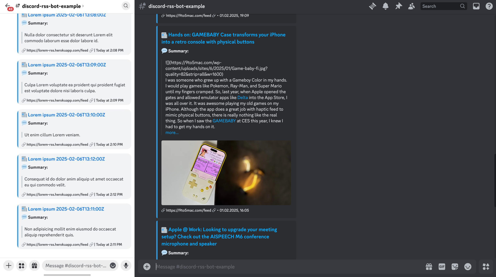

# RSSIFY

[](https://github.com/psf/black)
[](https://opensource.org/licenses/MIT)

A Discord bot that delivers RSS feed updates directly to your Discord channels — automatically, every hour!  
Empowered by [Feed Reader](https://github.com/lemon24/reader). Inspired by [FeedCord](https://github.com/Qolors/FeedCord).



---

## ✨ Features

- 🔄 **Automated RSS Feed Updates** — Feeds update automatically every hour via GitHub Actions.
- 📜 **Enhanced Message Formatting** — HTML converted to Markdown, summaries neatly truncated.
- 🖼️ **Image & Media Support** — Embeds use the first image from your feed.
- ⚡ **Efficient & Scalable** — Built using async and concurrent execution.
- 🧠 **Persistent Feed Tracking** — No duplicates; remembers what’s already sent.
- 🐋 **Docker & GitHub Actions Ready** — Deploy anywhere or let Actions host it for free.

---

## 🚀 How to Add Your Own Channel

You can connect your own Discord channel to receive RSS updates from this bot!  
Just follow these steps carefully 👇

### 🪄 Step 1: Add the Bot to Your Discord Server
- Invite the bot to your Discord server using this link:  
  👉 **[Invite Link- https://discord.com/oauth2/authorize?client_id=1437062662931484764&permissions=8&integration_type=0&scope=bot]**

---

### 🧬 Step 2: Fork This Repository
1. Click **“Fork”** at the top-right of this page to create your own copy.
2. In your forked repo, open the file **`config.yaml`**.
3. Scroll to the bottom and add your feed configuration like this:

   ```yaml
   feeds:
     - feed_url: add your RSS Feed URL you want
       channel_id: Your Channel ID ( WATCH THIS --> https://youtu.be/rbwvcyEx_Uc?si=NvQMUFVcfSKQbC0O IF YOU DON'T KNOW HOW TO GET THAT)
       update_interval: 30
   ```

📝 **Notes:**

* Replace the RSS URL and channel ID with your own.
* Add **only one** feed per code block.
* Don’t delete or modify existing entries — just append yours at the end.

---

### 📬 Step 3: Submit Changes

1. After editing `config.yaml`, **commit** your changes.
2. Open a **pull request (PR)** to this main repository.  
   I’ll review it and merge so your feed gets included.

Once merged, the GitHub Action will automatically update your channel every hour!

---

## ⚙️ GitHub Action Workflow

This repository uses a scheduled GitHub Action that:

* Runs the bot once every hour (`cron: "0 * * * *"`)
* Keeps the database persistent between runs
* Updates all configured RSS feeds in every connected channel

---

## 💻 Running Locally (Optional)

If you’d like to run the bot locally on your machine:

```bash
# Clone the repository
git clone https://github.com/unknowngamer69/rssify.git
cd rssify

# Install dependencies
pip install discord-rss-bot

# Create a data directory
mkdir data

# Run the bot
$env:TOKEN = "Your_Discord_Bot_Token"
python -m rssify --token $env:TOKEN --config config.yaml
```

> 💡 Tip: Replace `"Your_Discord_Bot_Token"` with your actual bot token.

---

## 🧾 Configuration Example

Here’s what your `config.yaml` might look like:

```yaml
db_path: data/rss.sqlite3

feeds:
  - feed_url: https://hnrss.org/frontpage
    channel_id: 123456789012345678
    update_interval: 30

  - feed_url: https://example.com/rss
    channel_id: 987654321098765432
    update_interval: 30
```

---

## 🪪 License

This project is licensed under the [MIT License](https://opensource.org/licenses/MIT).

---

## 💬 Credits

* Core Feed Handling: [reader](https://github.com/lemon24/reader)
* Inspiration: [FeedCord](https://github.com/Qolors/FeedCord)
* Maintainer: [@unknowngamer69](https://github.com/unknowngamer69)

---

## ⚡ Final Note

* RSS posts update automatically **every hour**.
* You don’t need to host anything — GitHub Actions does it for you.
* Want a new feed? Just fork → edit → PR → done 🎉
